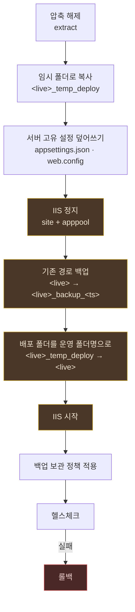
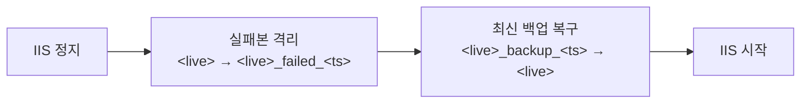

# 1. 로컬 배포 흐름

한 대의 서버 안에서 배포가 끝나는 경우. 빌드 산출물이 이미 그 서버에 있고,
같은 서버의 IIS 사이트를 교체한다.

**쓰는 자리**
- 개발 PC 에서 배포 동작을 검증할 때
- 개발서버와 운영서버가 같은 장비일 때
- 운영서버가 [운영 배포 흐름](02_운영_배포_흐름.md)의 후반부를 직접 수행할 때

---

## 흐름



색칠된 구간이 **서비스 중단 시간**이다. 준비 작업(복사·설정)을 정지 전에 끝내므로
중단 구간에는 **이름 바꾸기 두 번**만 남는다.

---

## 설정 예시

```yaml
name: "로컬 IIS 배포"
environment: "qa"
root: "D:/Deploy"

target:
  qa:
    # deploy_path 의 마지막 폴더명이 곧 IIS 사이트명이 된다 -> MFM.SHORE_QA
    deploy_path: "${root}/MFM.SHORE_QA"
    build_path: "${root}/staging"
    health_url: "https://localhost:8443/"
    config_dir: "${root}/hlngs/config/MFM.SHORE_QA"

backup:
  keep_recent_days: 7        # 최근 7일치 전부 보관
  keep_monthly_months: 2     # 1개월 전 · 2개월 전 각 달의 마지막 1개 보관
  dry_run: false             # true 면 삭제 대상만 출력

stages:
  - extract:
      file: "${root}/incoming/MFM.Shore.zip"
      dest: "${build_path}"
  - local_deploy: {}
  - health_check:
      url: "${health_url}"
      expect_status: 302
      follow_redirects: false
      retry: 12
      interval_sec: 5
      timeout_ms: 15000

rollback:
  - local_rollback: {}
```

---

## `local_deploy` 내부 단계

| 단계 | 동작 | 서비스 |
|---|---|---|
| 1 | `build_path` → `<live>_temp_deploy` 복사 | 정상 |
| 1.5 | `config_dir` 의 파일을 temp 위에 덮어쓰기 | 정상 |
| 2 | IIS 정지 (site + apppool) | **중단 시작** |
| 3 | `<live>` → `<live>_backup_<epochMillis>` | 중단 |
| 4 | `<live>_temp_deploy` → `<live>` | 중단 |
| 5 | IIS 시작 | **중단 끝** |
| 6 | 백업 보관 정책 적용 | 정상 |

**스왑 방식이지 병합이 아니다.** 이전 배포에서 사라진 파일이 라이브에 남지 않는다.
`xcopy` 병합 방식은 삭제된 DLL 이 영원히 남아 구버전 어셈블리가 로드되는 사고를 만든다.

### 서버 고유 설정 (`config_dir`)

폴더를 통째로 스왑하므로 라이브의 설정 파일도 함께 사라진다.
그래서 서버가 보관하는 설정을 **매 배포마다 다시 얹는다.**

```
D:/Deploy/hlngs/config/MFM.SHORE_QA/
  ├─ appsettings.json     ← 서버별 커넥션스트링 등
  └─ web.config           ← ASPNETCORE_ENVIRONMENT 등
```

폴더 안의 **모든 파일**을 배포본 최상위에 복사한다.
`config_dir` 을 지정했는데 폴더가 없거나 비어 있으면 **배포를 실패시킨다.**
조용히 건너뛰면 publish 기본 설정으로 서비스가 떠서, 에러 없이 잘못된 상태가 된다.

### IIS 제어

**관리자 권한이 필요하다.** 권한이 없으면 `appcmd` 가 `redirection.config` 를 읽지 못하고
종료코드 1168 로 실패한다.

실패 사유를 구분한다.

| 사유 | 처리 |
|---|---|
| 이미 원하는 상태 (`already started/stopped`) | 넘어감 |
| 권한 부족 | **즉시 실패** |
| 사이트/앱풀 없음 | **즉시 실패** |
| 그 외 | **즉시 실패** |

서비스를 세우지 못한 채 파일을 갈아치우면 안 되기 때문이다.
IIS 가 아닌 대상이면 `local_deploy: { manage_iis: false }` 로 명시적으로 끈다.

### 백업 보관 정책

백업 폴더 이름은 `<live 폴더명>_backup_<epochMillis>` 다.

1. 최근 `keep_recent_days` 일 이내 → 전부 보관
2. 1 ~ `keep_monthly_months` 개월 전 → **각 달의 마지막(최신) 1개**씩 보관
3. 나머지 삭제

달 계산은 `year*12 + month` 정수로 접는다(`setMonth` 의 말일 넘침 회피).
살아 있는 배포 경로와 겹치면 삭제를 거부한다.
**정리 실패는 배포 성공을 뒤집지 않는다** — 로그만 남기고 넘어간다.

---

## 롤백



실패본은 **지우지 않고** `_failed_<ts>` 로 남긴다. 원인 분석 대상이며
보관 정책(`_backup_` 만 대상) 밖이므로 확인 후 직접 정리해야 한다.

백업이 없을 때는 두 경우를 구분한다.

- 라이브가 그대로 있으면 → **되돌릴 변경이 없음**. 정상 종료
- 라이브가 사라졌는데 백업도 없으면 → **CRITICAL**. 수동 복구 필요

---

## 헬스체크 주의점

**콜드 스타트를 넘길 수 있어야 한다.**

`RazorCompileOnBuild=false` / `RazorCompileOnPublish=false` 로 빌드된 앱은
뷰가 첫 요청에 런타임 컴파일된다. WeSys Shore 기준 **첫 페이지 렌더에 약 50초**가 걸린다.
페이지 200 을 기다리면 정상 배포가 타임아웃으로 실패 판정되고 불필요한 롤백이 돈다.

그래서 **루트의 리다이렉트만 확인한다.**

```yaml
- health_check:
    url: "https://localhost:8443/"
    expect_status: 302          # / -> /Account/Login
    follow_redirects: false     # 리다이렉트를 따라가지 않는다
    retry: 12
    interval_sec: 5
    timeout_ms: 15000
```

배포 게이트가 확인할 것은 "프로세스가 떠서 라우팅이 동작하는가"이지
"뷰 컴파일까지 끝났는가"가 아니다.

자체서명 인증서는 기본으로 무시한다(`rejectUnauthorized: false`).
