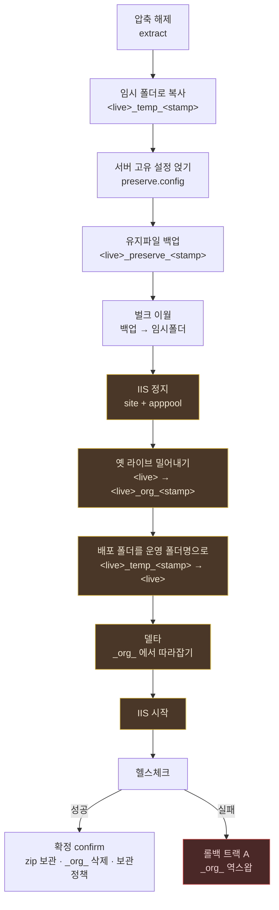
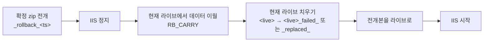

# 1. 로컬 배포 흐름

한 대의 서버 안에서 배포가 끝나는 경우. 빌드 산출물이 이미 그 서버에 있고,
같은 서버의 IIS 사이트를 교체한다.

**쓰는 자리**
- 개발 PC 에서 배포 동작을 검증할 때
- 개발서버와 운영서버가 같은 장비일 때
- 운영서버가 [운영 배포 흐름](02_운영_배포_흐름.md)의 후반부를 직접 수행할 때

---

## 흐름

아래는 `swap` 방식이다. `copy` 는 라이브를 그대로 두고 덮어쓰므로 스왑 칸이
`robocopy` 한 번으로 바뀌고 `_org_` 가 없다 — 나머지는 같다.


```mermaid
flowchart TD
    A["압축 해제<br/>extract"] --> B["임시 폴더로 복사<br/>&lt;live&gt;_temp_&lt;stamp&gt;"]
    B --> C["서버 고유 설정 얹기<br/>preserve.config"]
    C --> P["유지파일 백업<br/>&lt;live&gt;_preserve_&lt;stamp&gt;"]
    P --> Q["벌크 이월<br/>백업 → 임시폴더"]
    Q --> D["IIS 정지<br/>site + apppool"]
    D --> E["옛 라이브 밀어내기<br/>&lt;live&gt; → &lt;live&gt;_org_&lt;stamp&gt;"]
    E --> F["배포 폴더를 운영 폴더명으로<br/>&lt;live&gt;_temp_&lt;stamp&gt; → &lt;live&gt;"]
    F --> N["델타<br/>_org_ 에서 따라잡기"]
    N --> G["IIS 시작"]
    G --> I["헬스체크"]
    I -->|성공| K["확정 confirm<br/>zip 보관 · _org_ 삭제 · 보관정책"]
    I -->|실패| R["롤백 트랙 A<br/>_org_ 역스왑"]

    style D fill:#4a3728,stroke:#c9a227,color:#f0e6d2
    style E fill:#4a3728,stroke:#c9a227,color:#f0e6d2
    style F fill:#4a3728,stroke:#c9a227,color:#f0e6d2
    style N fill:#4a3728,stroke:#c9a227,color:#f0e6d2
    style G fill:#4a3728,stroke:#c9a227,color:#f0e6d2
    style R fill:#4a2828,stroke:#c94a4a,color:#f0d2d2
```

색칠된 구간이 **서비스 중단 시간**이다. 준비 작업(복사·설정·유지파일 백업·벌크 이월)을
정지 전에 끝내므로 중단 구간에는 **이름 바꾸기 두 번과 델타**만 남는다.
QA 실측 **약 1.4초**(2026-09-23).

**이름 바꾸기와 삭제는 헬스체크 뒤(`confirm`)로 모았다.** 그 전까지 라이브 옆에 남아 있는
`_org_`·`_temp_` 가 곧 복구 수단이라, 앞당기면 되돌릴 판을 이미 치운 뒤가 된다.

---

## 설정 예시

```yaml
name: "로컬 IIS 배포"
environment: "qa"
root: "D:/Deploy"

target:
  qa:
    # deploy_path 의 마지막 폴더명이 곧 IIS 사이트명이 된다 -> MFM.SHORE_QA
    deploy_path: "${root}/MFM.SHORE_QA"
    build_path: "${root}/staging"
    health_url: "https://localhost:8443/"
    config_dir: "${root}/hlngs/config/MFM.SHORE_QA"

backup:
  keep_recent_days: 7        # 최근 7일치 전부 보관
  keep_monthly_months: 2     # 1개월 전 · 2개월 전 각 달의 마지막 1개 보관
  dry_run: false             # true 면 삭제 대상만 출력

stages:
  - extract:
      file: "${root}/incoming/MFM.Shore.zip"
      dest: "${build_path}"
  - local_deploy: {}
  - health_check:
      url: "${health_url}"
      expect_status: 302
      follow_redirects: false
      retry: 12
      interval_sec: 5
      timeout_ms: 15000

rollback:
  - local_rollback: {}
```

---

## `local_deploy` 내부 단계

| 단계 | 동작 | 방식 | 서비스 |
|---|---|---|---|
| 1 | `build_path` → `<live>_temp_<stamp>` 복사 | 둘 다 | 정상 |
| 1.5 | 라이브의 설정(`preserve.config`)을 temp 위에 얹기 | **`swap` 만** | 정상 |
| 1.7 | 유지파일 백업 → `<live>_preserve_<stamp>` | 둘 다 | 정상 |
| 1.8 | 백업에서 임시폴더로 **벌크 이월** | **`swap` 만** | 정상 |
| 2 | IIS 정지 (site + apppool) | 둘 다 | **중단 시작** |
| 3 | `<live>` → `<live>_org_<stamp>` | `swap` | 중단 |
| 3' | `robocopy` 배포본 → 라이브 (`DP_EXCLUDE`=설정) | `copy` | 중단 |
| 4 | `<live>_temp_<stamp>` → `<live>` | `swap` | 중단 |
| 4.5 | 델타 — `_org_` 에서 따라잡기 (`/E /XO`) | `swap` | 중단 |
| 5 | IIS 시작 | 둘 다 | **중단 끝** |
| — | 헬스체크 → **`confirm`** (zip 확정 · `_org_`/`_temp_` 삭제 · 보관정책) | 둘 다 | 정상 |

**`swap` 은 스왑이지 병합이 아니다.** 이전 배포에서 사라진 파일이 라이브에 남지 않는다.
`xcopy` 병합 방식은 삭제된 DLL 이 영원히 남아 구버전 어셈블리가 로드되는 사고를 만든다.
**`copy` 는 반대로 남긴다** — 그 대신 폴더를 rename 하지 않아 **누가 열고 있어도 배포된다.**
둘 중 무엇이 맞는지는 상황이 정하므로 `deploy_mode` 로 고른다.

### 서버 고유 설정 (`preserve.config`)

`swap` 은 폴더를 통째로 갈아끼우므로 라이브의 설정 파일도 함께 사라진다.
그래서 **정지 전에** 라이브의 설정을 배포본 위에 얹는다(Step 1.5).

```yaml
preserve:
  config: ["web.config", "appsettings.json"]
```

**`copy` 에서는 이 단계를 건너뛴다.** 라이브를 그대로 두므로 설정이 사라질 일이 없고,
산출물의 설정이 라이브를 덮지 않게 막는 것이 전부인데 그것은 `DP_EXCLUDE` 가 한다.

어느 쪽을 쓸지는 **시각으로 정한다** — `config_backup` 의 사본이 라이브보다 최근이면
그쪽이 이긴다. 둘 다 없으면 **배포를 실패시킨다.** 조용히 넘기면 publish 기본 설정으로
서비스가 떠서, 에러 없이 잘못된 상태가 된다.

### IIS 제어

**관리자 권한이 필요하다.** 권한이 없으면 `appcmd` 가 `redirection.config` 를 읽지 못하고
종료코드 1168 로 실패한다.

실패 사유를 구분한다.

| 사유 | 처리 |
|---|---|
| 이미 원하는 상태 (`already started/stopped`) | 넘어감 |
| 권한 부족 | **즉시 실패** |
| 사이트/앱풀 없음 | **즉시 실패** |
| 그 외 | **즉시 실패** |

서비스를 세우지 못한 채 파일을 갈아치우면 안 되기 때문이다.
IIS 가 아닌 대상이면 `local_deploy: { manage_iis: false }` 로 명시적으로 끈다.

### 백업 보관 정책

백업은 **`<backup_root>\<web_server_name>\` 밑**에 모인다. 프로젝트별로 한 겹 파는 이유는
정리 규칙 때문이 아니라 **사람 때문이다** — 한 폴더에 여러 프로젝트의 백업과 다른 도구의
산출물이 섞여 있으면 뭘 지워도 되는지 판단이 안 서고, 그 판단은 대개 급할 때 해야 한다.

```
<backup_root>\<web_server_name>\
  <live>_preserve_<stamp>\        유지파일 백업 (temp + data + config)
  _builds\<live>_<stamp>.zip      확정 빌드 = 롤백의 원본
```

정책은 **개수 하나**(`backup.keep_count`, 기본 3)이고 **유지파일 백업과 확정 zip 에 함께**
걸린다. 종류마다 따로 두면 셋 중 하나만 지워져 짝이 깨진다.
날짜 기준을 쓰지 않는 이유는 하루에 몇 번 배포하느냐에 따라 용량 상한이 안 잡혀서다(1회 690MB).

**이 개수가 곧 `--rollback=N` 의 상한이다.** 남기지 않은 것은 되돌릴 수 없다.

살아 있는 배포 경로와 겹치면 삭제를 거부한다.
**정리 실패는 배포 성공을 뒤집지 않는다** — 로그만 남기고 넘어간다.

> 옛 규칙(`<live>_<stamp>` 폴더 백업, `keep_recent_days`·`keep_monthly_months`)은 폐지됐다.
> 라이브 사본을 뜨지 않으므로 되돌릴 곳은 확정 zip 하나다. 서버에 남아 있는 옛 폴더 백업은
> 계속 쓸어내되 **새로 만들지는 않는다.**

---

## 롤백

되돌릴 곳이 **확정 zip** 이므로, 롤백은 "그 zip 을 다시 배포한다" 와 같다 —
비상시에만 도는 코드가 아니라 매일 도는 길을 탄다.


```mermaid
flowchart LR
    Z["확정 zip 전개<br/>_rollback_&lt;ts&gt;"] --> A["IIS 정지"]
    A --> Y["현재 라이브에서 데이터 이월<br/>RB_CARRY"]
    Y --> B["현재 라이브 치우기<br/>&lt;live&gt; → &lt;live&gt;_failed_ 또는 _replaced_"]
    B --> C["전개본을 라이브로"]
    C --> D["IIS 시작"]
```

전개는 **정지 전**이다. 느린 일이고 라이브를 건드리지 않으므로 서비스를 내린 채 돌릴 이유가 없다.
**스왑 직후 실패(트랙 A)라면 `_org_` 가 아직 옆에 있어 전개 없이 역스왑한다** — 몇 초다.

`RB_CARRY` 는 **현재 라이브에서** 가져온다. 롤백은 코드를 옛 빌드로 되돌리는 일이고,
업로드와 설정은 지금 것이 맞다.

실패본은 바로 지우지 않고 `_failed_<ts>` 로 남긴다 — 원인 분석 대상이다.
**다음 배포가 성공하면 지운다.** 성공한 배포가 나왔다면 그 실패는 지나갔고,
앞으로 갈 사본은 배포 zip 이다. 보관 정책(`backup.enabled`·`dry_run`)을 그대로 따른다.

강제 롤백(`--rollback=N`)이 밀어낸 라이브는 `_replaced_<ts>` 로 치웠다가
**서비스가 다시 뜨면 바로 지운다.** 강제 롤백을 했다는 것은 그 라이브가 문제였다는 뜻이고,
운영 데이터는 이미 `preserve` 로 넘어왔다. 지우지 못하면 남고, 다음 배포 성공 때 지운다.

백업이 없을 때는 두 경우를 구분한다.

- 라이브가 그대로 있으면 → **되돌릴 변경이 없음**. 정상 종료
- 라이브가 사라졌는데 백업도 없으면 → **CRITICAL**. 수동 복구 필요

---

## 헬스체크 주의점

**콜드 스타트를 넘길 수 있어야 한다.**

`RazorCompileOnBuild=false` / `RazorCompileOnPublish=false` 로 빌드된 앱은
뷰가 첫 요청에 런타임 컴파일된다. WeSys Shore 기준 **첫 페이지 렌더에 약 50초**가 걸린다.
페이지 200 을 기다리면 정상 배포가 타임아웃으로 실패 판정되고 불필요한 롤백이 돈다.

그래서 **루트의 리다이렉트만 확인한다.**

```yaml
- health_check:
    url: "https://localhost:8443/"
    expect_status: 302          # / -> /Account/Login
    follow_redirects: false     # 리다이렉트를 따라가지 않는다
    retry: 12
    interval_sec: 5
    timeout_ms: 15000
```

배포 게이트가 확인할 것은 "프로세스가 떠서 라우팅이 동작하는가"이지
"뷰 컴파일까지 끝났는가"가 아니다.

자체서명 인증서는 기본으로 무시한다(`rejectUnauthorized: false`).
