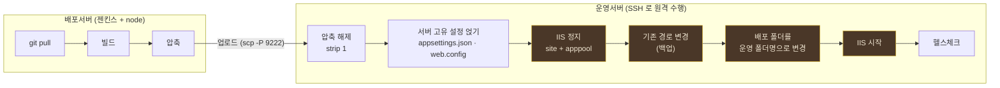

# 2. 운영 배포 흐름

배포서버(젠킨스)와 운영서버가 분리된 구조. 빌드는 배포서버가, 서비스 교체는 운영서버가 한다.

**교체 주체는 운영서버의 배치파일이 아니다.** 배포서버의 node 파이프라인이 SSH 로
운영서버에 접속해 해제·정지·스왑·시작을 직접 지휘한다. 기존 `wesys_restart.bat` 은
**참고 자료**이지 호출 대상이 아니다 — 그 배치가 무엇을 왜 했는지는 아래
[기존 배치에서 확인된 문제](#기존-배치에서-확인된-문제)에 정리했다.



색칠된 구간이 서비스 중단 시간이다. 해제와 설정 얹기를 **정지 전에** 끝내는 것이 요점이다.
백업·배포 두 rename 은 같은 `D:` 볼륨 안 이동이라 즉시 끝난다 — 실질 중단은 IIS 재기동 시간이다.

---

## 배포서버 (젠킨스)

| 단계 | 스테이지 | 상태 |
|---|---|---|
| 변경 감지 (git diff) | — | Jenkins 스케줄이 담당. 파이프라인 밖 |
| git pull | `git_sync` | ✅ 검증됨 |
| 빌드 | `c#_build` | ✅ 검증됨 |
| 압축 | `archive` | ✅ 검증됨 (2026-08-28 배치 변경) |
| 운영서버 업로드 | `other_server` | ⚠️ **미검증 · 보완 필요** (수동 scp 는 검증됨) |
| 알림 | — | ❌ 스테이지 없음 |

```yaml
name: "WeSys QA 배포"
environment: "qa"
deploy_path: "D:/Deploy"
git_url: "http://112.217.163.10:16784/WeSys.git"   # 자격증명은 실행 주체가 처리

target:
  qa:
    branch: "deploy/qa"
    build_path: "${deploy_path}/build/MFM.SHORE_QA"
    publish_path: "${deploy_path}/build/_publish/MFM.SHORE_QA"
    artifact_dir: "${deploy_path}/build/_artifacts"

stages:
  - git_sync: {}
  - c#_build:
      # -r / --self-contained 를 명시한다. pubxml 을 읽지 않으므로 여기가 유일한 정본이다.
      cmd: 'dotnet publish MFM.Shore/Web/MFM.Shore.csproj -c Release -r win-x64 --self-contained true -o "${publish_path}"'
  - archive:
      src: "${publish_path}"
      dest: "${artifact_dir}"
      name: "MFM.SHORE_QA"
```

### 압축 방식 — 최상위 폴더를 하나 둔다

```js
tar -a -c -f "<zip>" -C "<src 의 부모>" "<src 폴더명>"
```

아카이브 안이 `MFM.SHORE_QA/appsettings.json` 처럼 **최상위 폴더 한 겹**을 갖는다.
푸는 쪽이 `strip: 1` 로 그 한 겹을 벗긴다.

> ⚠️ **`-C <src> .` 로 만들면 안 된다.** 기존 젠킨스 배치가 그 형태였고
> `archive` 스테이지도 그것을 물려받았다가 2026-08-28 에 고쳤다.
>
> ```bat
> tar -a -cf "%HLNGS_BUILD_HOME%\MFM.Shore.zip" -C "%HLNGS_BUILD_HOME%\MFM.Shore" .
> ```
>
> 마지막 인자 `.` 때문에 엔트리 이름이 전부 `./` 로 시작한다. 파일 자체는 규격
> PKZIP 이고 `tar`·.NET `ZipFile` 은 정규화해서 정상 해제하지만, **윈도우 탐색기
> (`zipfldr.dll`)는 `./` 를 리터럴로 다뤄 루트 항목을 0개로 계산한다.**
> 더블클릭하면 빈 창이 뜨고 "압축 풀기"를 눌러도 아무것도 나오지 않는다.
>
> 자동 배포는 정상 동작하므로 **사람이 산출물을 열어볼 때만 실패한다.** 조용히
> 넘어가는 종류의 결함이라, 배포가 되고 있다는 사실이 이 결함의 부재를 증명하지 않는다.

폴백인 `Compress-Archive` 도 같은 배치를 내야 한다. `-Path <src>\*` 처럼 와일드카드를
붙이면 내용만 평평하게 들어가 `strip: 1` 과 어긋나므로, **폴더 자체**를 지정한다.

명령이 종료코드 0 으로 끝나도 **산출물 파일이 없으면 실패로 처리한다.**

#### 왜 파일 목록 나열이 아닌가

`./` 를 없애는 다른 방법도 있지만 전부 이 방식보다 못하다.

| 방법 | 결과 |
|---|---|
| 최상위 항목 이름을 전부 인자로 나열 | 동작하지만 QA 기준 **188개 · 5,662자**. `cmd.exe` 8,191자 한계에 근접 |
| `bsdtar -s` 경로 치환 | **Windows 기본 tar.exe 가 미지원** (bsdtar 3.5.2) |
| `-T` 목록 파일 | 동작하지만 목록 파일 인코딩(BOM)에 걸린다 |
| **최상위 폴더 1개** | 멤버 인자가 1개. 길이 한계와 무관 |

### 업로드

기존 젠킨스 Job 이 하던 일:

```bat
scp -P 9222 -i "C:/Users/<user>/.ssh/hlng_web_rsa" %HLNGS_BUILD_HOME%\MFM.Shore.gz administrator@<운영서버>:D:\HLNGS\build
```

이후 publish-over-ssh 플러그인이 원격에서 `D:\HLNGS\wesys_restart.bat ${TAG_DEPLOY}` 실행.
**새 흐름은 그 배치를 부르지 않고 뒷단계를 직접 수행한다.**

> ⚠️ 현재 `other_server` 스테이지는 두 가지가 이 흐름에 맞지 않는다.
> 1. **`build_path` 전체를 `scp -r`** 한다. 이 흐름은 **압축파일 1개**만 올린다.
> 2. **포트 지정(`-P` / `-p`)을 지원하지 않는다.** 운영서버는 22 번이 아니라 **9222** 다.

`archive` 스테이지는 생성한 경로를 `context.variables.archive_path` 에 실어 두므로
업로드 스테이지가 그대로 참조할 수 있다.

**업로드 후에는 해시를 대조한다.** 크기만으로는 부분 전송을 잡지 못한다.

---

## 운영서버

운영서버의 동작은 [로컬 배포 흐름](01_로컬_배포_흐름.md)과 같다.
`extract` + `local_deploy` 가 기존 `wesys_restart.bat` 을 대체한다.

| 기존 bat 동작 | 스테이지 |
|---|---|
| 압축 해제 | `extract` (**`strip: 1`**) |
| 설정파일 복사 (web.config) | `local_deploy` Step 1.5 (`config_dir`) |
| 서버 종료 | `local_deploy` Step 2 |
| 기존 경로 변경 (백업) | `local_deploy` Step 3 |
| 배포 폴더 → 운영 폴더명 | `local_deploy` Step 4 |
| 서버 시작 | `local_deploy` Step 5 |
| *(기존에 없음)* 백업 정리 | `local_deploy` Step 6 |
| *(기존은 별도 bat)* 롤백 | `rollback: local_rollback` |

```yaml
name: "운영서버 배포"
environment: "qa"
root: "D:/HLNGS"

target:
  qa:
    deploy_path: "D:/Deploy/MFM.SHORE_QA"      # IIS physicalPath 와 정확히 같아야 한다
    build_path: "${root}/build/MFM_QA.Shore"
    artifact: "${root}/build/MFM_QA.Shore.zip"
    config_dir: "${root}/config/qa"
    backup_root: "${root}/backup"
    health_url: "https://wesysqa.hls.co.kr/healthz"   # QA 는 이 도메인으로 접근한다

backup:
  keep_recent_days: 7
  keep_monthly_months: 2

stages:
  - extract:
      file: "${artifact}"
      dest: "${build_path}"
      strip: 1                  # 아카이브 최상위 폴더 한 겹을 벗긴다
  - local_deploy: {}
  - health_check:
      url: "${health_url}"
      expect_status: 200
      retry: 12
      interval_sec: 5

rollback:
  - local_rollback: {}
```

### 헬스체크 대상 — QA 도메인

**QA 는 `wesysqa.hls.co.kr:443` 으로 접근한다.** 바인딩이 셋 있지만 이것이 정본이다.
`localhost:8443` 은 서버 안에서만 유효하고, 배포서버에서 원격으로 지휘하는 이 흐름에서는
**요청이 배포서버에서 나가므로** 도메인으로 확인해야 한다.

배포서버에서 실측한 응답 (2026-08-28):

| URL | 응답 |
|---|---|
| `https://wesysqa.hls.co.kr/healthz` | **200** · body `Healthy` |
| `https://wesysqa.hls.co.kr/` | **302** → `/Account/Login` (55 ms) |

`/healthz` 를 1순위로 둔다. 앱이 자기 상태를 선언하는 엔드포인트이고, Razor 뷰가 아니라서
[로컬 흐름](01_로컬_배포_흐름.md#헬스체크-주의점)에서 경고한 **첫 렌더 50초 콜드 스타트에
걸리지 않는다.** 루트 302 는 대체 수단이다.

`/healthz` 는 상태코드와 본문이 함께 의미를 갖는다 — 기존 bat 도 `Healthy` 문자열을
비교했다. 상태코드만 보면 앱이 떠 있으나 의존성(DB 등)이 죽은 상태를 통과시킬 수 있다.

자체서명이 아닌 정식 인증서지만, 검증 실패로 배포가 막히지 않도록 무시 설정은 유지한다.

> ⚠️ **`strip` 을 옛 아카이브에 적용하면 안 된다.** `./` 형식 아카이브에 `strip: 1` 을
> 주면 최상위 파일이 통째로 빠지는데 **tar 는 종료코드 0 을 돌려준다.** 자동 판별을
> 넣지 않고 명시 옵션으로 둔 이유다 — 옛 산출물과 새 산출물이 섞여 도는 전환 구간이
> 유일한 위험 구간이고, 그 구간을 사람이 인지하고 넘기는 편이 낫다.

### 실측 정보 (2026-08-28 확인)

| 항목 | 값 |
|---|---|
| 호스트 | `DBXWDSY3` · `administrator@221.139.50.188 -p 9222` |
| SSH 키 | `~/.ssh/hlng_web_rsa` (`~/.ssh/config` 에 등록. **Port 는 미등록 — 직접 지정**) |
| 산출물 도착 | `D:\HLNGS\build\` |
| 해제 경로 | `D:\HLNGS\build\MFM_QA.Shore` |
| 사이트 루트 | `D:\Deploy\MFM.SHORE_QA` |
| 백업 | `D:\HLNGS\backup` |
| 설정 정본 | `D:\HLNGS\config\qa\{appsettings.json, web.config}` (`prod\` 도 존재) |
| IIS | site `MFM.SHORE_QA` · apppool `MFM.SHORE_QA` |
| 바인딩 | `*:80:qa.hls.co.kr` · `*:8443:` · `*:443:wesysqa.hls.co.kr` |
| **접근 도메인** | **`https://wesysqa.hls.co.kr`** (443) — 헬스체크·확인은 여기로 |
| tar | `C:\Windows\system32\tar.exe` 존재 |

**QA 는 외부에서 접근된다.** 로컬 테스트 사이트가 아니므로 중단 시점을 의식해야 한다.

업로드 실측: 158 MB 를 `scp -P 9222` 로 **14.5초**, SHA256 일치.

### 게시 방식 — pubxml 을 읽지 않는다

`dotnet publish -o <경로>` 만 쓰면 **`Properties/PublishProfiles/FolderProfile.pubxml` 이
전혀 반영되지 않는다.** 그 프로필이 들고 있는 값이 이것이다.

```xml
<PublishUrl>D:\Deploy\HLNG\MFM.Shore</PublishUrl>   ← 개발서버마다 다른 유일한 값
<SelfContained>true</SelfContained>
<RuntimeIdentifier>win-x64</RuntimeIdentifier>
<TargetFramework>net6.0</TargetFramework>
<DeleteExistingFiles>true</DeleteExistingFiles>
```

경로가 환경마다 달라 **서버별로 pubxml 을 따로 만들어 쓰던 것**이 원래 방식이었다.
파이프라인에서는 **경로를 파라미터로 넘기고 나머지를 명령에 명시**한다 —
프로필 사본을 관리할 이유가 사라진다.

```bash
dotnet publish MFM.Shore/Web/MFM.Shore.csproj -c Release \
  -r win-x64 --self-contained true -o "${publish_path}"
```

> ⚠️ 프로필을 정본으로 두고 경로만 덮어쓰려면 `-p:PublishProfile=FolderProfile
> -p:PublishDir="<경로>/"` 로도 된다(전역 속성이 pubxml 을 이긴다). 다만 역슬래시로 끝나는
> 경로는 `\"` 가 따옴표를 먹으니 슬래시로 써야 한다.

> ⚠️ **`-o` 는 기존 파일을 지우지 않는다.** pubxml 의 `DeleteExistingFiles=true` 에 해당하는
> 동작이 없어, 출력 폴더에 옛 빌드 잔재가 쌓인다. `c#_build` 가 출력 폴더를 먼저 비워야 한다.

#### self-contained 를 유지하는 이유

`--self-contained` 를 빠뜨리면 산출물 성격이 통째로 바뀐다. 실측 비교다.

| | 파일 수 | 크기 | 최상위 |
|---|---|---|---|
| self-contained (현행) | 4,621 | 724 MB | 562 |
| framework-dependent | 4,039 | 548 MB | 188 |

차이는 런타임이다. self-contained 쪽에는 `coreclr.dll` · `hostfxr.dll` ·
`System.Private.CoreLib.dll` · `Microsoft.AspNetCore.*.dll` 등 **약 370개의 프레임워크
어셈블리**가 들어 있다.

**폴더 스왑에서는 이 차이가 사고가 된다.** 기존 `xcopy` 병합은 라이브에 남아 있던 런타임
DLL 이 우연히 완충 역할을 했지만, rename 스왑은 앱 폴더를 통째로 갈아끼우므로 앱 로컬
런타임이 그대로 사라진다.

framework-dependent 로 가는 것 자체는 가능하다. 서버 런타임을 확인했다.

```
요구 (MFM.Shore.runtimeconfig.json)   tfm net6.0
    Microsoft.NETCore.App        6.0.0
    Microsoft.WindowsDesktop.App 6.0.0
    Microsoft.AspNetCore.App     6.0.0

서버 설치 (dotnet --list-runtimes)
    Microsoft.NETCore.App        6.0.7 · 6.0.25 · 8.0.18
    Microsoft.WindowsDesktop.App 6.0.7 · 6.0.25
    Microsoft.AspNetCore.App     6.0.7 · 6.0.20
```

세 프레임워크가 모두 있어 롤포워드로 동작은 한다. 그런데 그렇게 하면 **서버에 6.x 런타임이
유지된다는 전제가 파이프라인에 새로 생긴다** — 런타임 제거·업그레이드가 곧 배포 실패가 된다.

**그래서 현재는 self-contained 를 유지한다.** 배포 방식(xcopy 병합 → rename 스왑)과 게시
방식을 한 번에 둘 다 바꾸지 않는다. 자동 롤백이 없는 QA 에서 변수를 하나씩 움직인다.
framework-dependent 전환은 별건으로 다룬다.

`Microsoft.AspNetCore.App` 은 **8.x 가 없다.** net8.0 으로 올릴 때는 호스팅 번들 설치가
선행되어야 한다.

### 런타임 업로드 파일

폴더 스왑은 라이브에만 있던 파일을 백업으로 넘긴다. 사용자가 런타임에 올린 파일이
사이트 루트에 쌓이는 구조라면 스왑마다 유실되는 셈이 된다.

QA 기준 확인 결과 **그런 파일은 없다** — `wwwroot` 가 라이브 2,082개 · 신규 2,082개로
같고 라이브에만 있는 파일이 0개다. 사이트 루트가 라이브 4,912개 / 746 MB 로 커 보이는 것은
런타임 DLL 과 `xcopy` 가 지우지 못한 과거 배포 잔재 때문이다.

**스왑 방식 전환 자체가 이 잔재를 청소한다.**

### `TAG_DEPLOY`

기존 젠킨스 파라미터. 버전 태그가 아니라 **배포 범위 스위치**다.

| 값 | 의미 |
|---|---|
| `test` (기본) | TEST 서비스만 배포 |
| `qa` | QA 서비스 배포 |
| `prod` | TEST 배포 후 PROD 까지 배포 |

파이프라인에서는 `environment` 프로파일로 표현한다.
조건 분기가 스크립트 안에 있지 않고 **선언으로 평평해진다** — 기존 bat 이
복잡해진 원인이 이 분기였다.

---

## 기존 배치에서 확인된 문제

새 흐름으로 옮기며 해소되는 것들이다. (`wesys_restart.bat` · `wesys_check_param.bat` ·
`wesys_restart_sub.bat` 실물 확인)

**1. staging 정리가 동작하지 않는다**

```bat
if exist "%pathBuild" (     ← 닫는 % 누락
```

`%pathBuild` 라는 리터럴은 존재할 수 없으므로 `rmdir` 이 영원히 실행되지 않는다.
이전 배포 잔재가 staging 에 계속 쌓이고 그대로 라이브까지 간다.

**2. `xcopy` 병합이라 삭제된 파일이 남는다**

기존은 `xcopy /y /s` 로 라이브 위에 덮어쓴다. 릴리스에서 빠진 DLL 이 라이브에 영원히 남아
구버전 어셈블리가 로드될 수 있다. 새 흐름은 **폴더 스왑**이라 이 문제가 없다.

**3. 재시도가 실패를 가린다**

`xcopy` 를 10회까지 재시도하는데 계속 실패해도 `STATUS_CODE=FAIL` 만 남고 원인이 남지 않는다.

**4. 설정 보존이 "안 건드려서" 이뤄진다**

기존은 빌드본에서 `del appsettings*.json` 으로 지워 라이브 것이 살아남게 한다.
새 흐름은 `config_dir` 에서 **명시적으로 얹는다.** 설정의 출처가 분명해진다.

**5. 헬스체크가 다른 서버를 본다**

`wesys_check_param.bat` 이 `HEALTH_URL_TEST` 를 환경별로 계산해 두는데,
`wesys_restart_sub.bat` 의 체크 루프는 `%HEALTH_URL%` 를 쓴다.

```bat
curl --insecure -s %HEALTH_URL% > curl_result.txt
```

`%HEALTH_URL%` 는 **운영 URL**(`wesys.hls.co.kr`)이다. QA 를 배포하고 운영을 확인하는 셈이라
**항상 `Healthy` 가 나온다** — 실패를 감지할 수 없는 검사다.

**6. QA 는 백업도 롤백도 없다**

```bat
if "%TAG_DEPLOY%" == "qa" ( goto lEnd )
```

헬스체크 직후 이 분기로 빠져서 백업 보관과 롤백 블록을 건너뛴다.
QA 가 깨지면 복구가 전부 수동이다.

**7. 백업 파일명이 환경을 반영하지 않는다**

`set backupFileName=%baseFileName%` 이 `qa` 분기보다 **먼저** 실행된다.
그래서 QA 배포의 백업 이름도 `MFM.Shore_...` 가 된다. (현재는 6번 때문에 QA 백업 자체가
돌지 않아 드러나지 않는다.)

**8. 산출물 확장자가 `.gz` 로 고정돼 있다**

```bat
set fileUpload=%baseFileName%.gz
tar -xzf "%PJT_ROOT%\build\%fileUpload%" -C "%pathBuild%"
```

젠킨스 쪽은 `.zip` 으로 옮겼는데 서버 쪽은 `.gz` 를 읽는다. 실제 서버에도 `.gz` 만 있다.
참고로 `-xzf` 자체는 문제가 아니다 — **bsdtar 는 압축 형식을 자동 판별하므로 `-z` 를 준 채
zip 도 푼다.** 걸리는 것은 파일명이다.

---

## 운영 적용 전 확인 항목

- [x] SSH 접속·키·포트 확인 (`administrator@221.139.50.188 -p 9222`, `hlng_web_rsa`)
- [x] 운영서버 경로·IIS 사이트명·앱풀명·바인딩 확인
- [x] 설정 정본 위치 확인 (`D:\HLNGS\config\qa`)
- [x] 아카이브 형식 문제 해소 (`./` → 최상위 폴더 + `strip: 1`)
- [x] 업로드 무결성 확인 방법 (SHA256 대조)
- [x] 런타임 업로드 파일 유무 확인 (QA `wwwroot` 기준 없음)
- [x] 헬스체크 대상 확정 (`https://wesysqa.hls.co.kr/healthz` → 200 `Healthy`)
- [x] 게시 방식 확정 — **self-contained 유지** (`-r win-x64 --self-contained true`)
- [x] **QA 실배포 1회 검증 완료 (2026-08-28)** — 아래 기록 참조
- [ ] `other_server` 단일 파일 업로드 + 포트(`-P`) 지원 추가
- [ ] `c#_build` 가 `publish_path` 를 먼저 비우도록 (`-o` 는 삭제하지 않는다)
- [ ] `extract` 의 `strip: 1` 을 수신측 yaml 에 반영
- [ ] framework-dependent 전환 여부 — 별건. 서버 6.x 런타임 유지가 전제로 붙는다
- [ ] 운영서버에 Node 설치 여부 결정 (설치하지 않으면 원격 명령 오케스트레이션 방식)
- [ ] SSH 실행 세션의 권한 확인 — **IIS 제어에는 관리자 권한이 필요하다**
- [ ] 첫 배포는 `backup.dry_run: true` 로 두고 삭제 대상 육안 확인 후 전환
- [ ] 알림(텔레그램) 스테이지 신설 여부
- [ ] `_failed_*` 디렉터리 정리 주기 — 보관 정책 대상이 아니다

---

## 실배포 기록 — QA (2026-08-28)

`other_server` 스테이지가 아직 이 흐름을 지원하지 않아 **수동으로 1회 통과시켰다.**
아래가 그대로 스테이지 구현의 사양이다.

| # | 수행 | 결과 |
|---|---|---|
| 1 | `dotnet publish -c Release -r win-x64 --self-contained true -o <publish>` | exit 0 · 30.1s · 4,621파일 / 724,217,189 B |
| 2 | `archive` 스테이지 (deploy-cli 실경로) | `MFM.SHORE_QA_20260828_102244.zip` · 230.7 MB · 388.8s |
| 3 | 아카이브 형식 확인 | 최상위 `MFM.SHORE_QA/` · `./` 엔트리 0개 · **탐색기 루트 항목 1개** |
| 4 | `scp -P 9222` 업로드 | 21s · SHA256 일치 |
| 5 | `tar -xf … --strip-components=1` | exit 0 · 4,621 / 724,217,189 / 562 |
| 6 | 배포본의 `appsettings*.json` 제거 | `Development` · `Staging` · 기본값 3개 |
| 7 | 라이브의 `appsettings.json` · `web.config` 복사 | 해시 일치 확인 |
| 8 | IIS 정지 → 백업 이동 → 배포 이동 → 시작 | appcmd 전부 exit 0 |
| 9 | 헬스체크 | 서버 로컬 · 외부 도메인 모두 `200 Healthy` |

**중단 시간 약 10초.** 백업은 `D:\HLNGS\backup\MFM.SHORE_QA_backup_20260828_103234`.

### 이번에 드러난 것

**사이트 루트가 줄었다** — 4,912파일 / 746 MB / 최상위 577 → **4,619 / 724 MB / 560**.
`xcopy` 병합이 수년간 지우지 못한 과거 배포 잔재가 rename 스왑으로 한 번에 청소됐다.
[기존 배치 문제 2번](#기존-배치에서-확인된-문제)이 실측으로 확인된 셈이다.

**`ASPNETCORE_ENVIRONMENT=QA`** 다(`web.config`). 배포본에 딸려 오는
`appsettings.Development.json` · `appsettings.Staging.json` 은 이 환경에서 로드되지 않지만,
환경 이름이 바뀌는 순간 조용히 설정이 뒤집힌다. 기존 bat 과 동일하게 **payload 의
`appsettings*.json` 을 전부 제거한 뒤 라이브 것을 얹는** 순서를 유지한다.

**설정 정본은 라이브다.** `D:\HLNGS\config\qa\appsettings.json` 은 라이브와 값이 다르고
(`ConnectionStrings.APIContext`) **JSON 문법도 깨져 있다**(쉼표 누락). 기존 bat 이 그 파일을
쓴 적이 없어 아무도 몰랐다. `config_dir` 은 배포 입력이 아니라 **배포 성공 후 기록하는
백업**으로 역할을 뒤집는다.

> ⚠️ `appsettings.json` 에는 DB·SMTP 계정이 **평문**으로 들어 있다. 로그·공지·diff 에
> 값을 실으면 안 된다 — 파일 경로와 키 이름까지만 출력한다.
