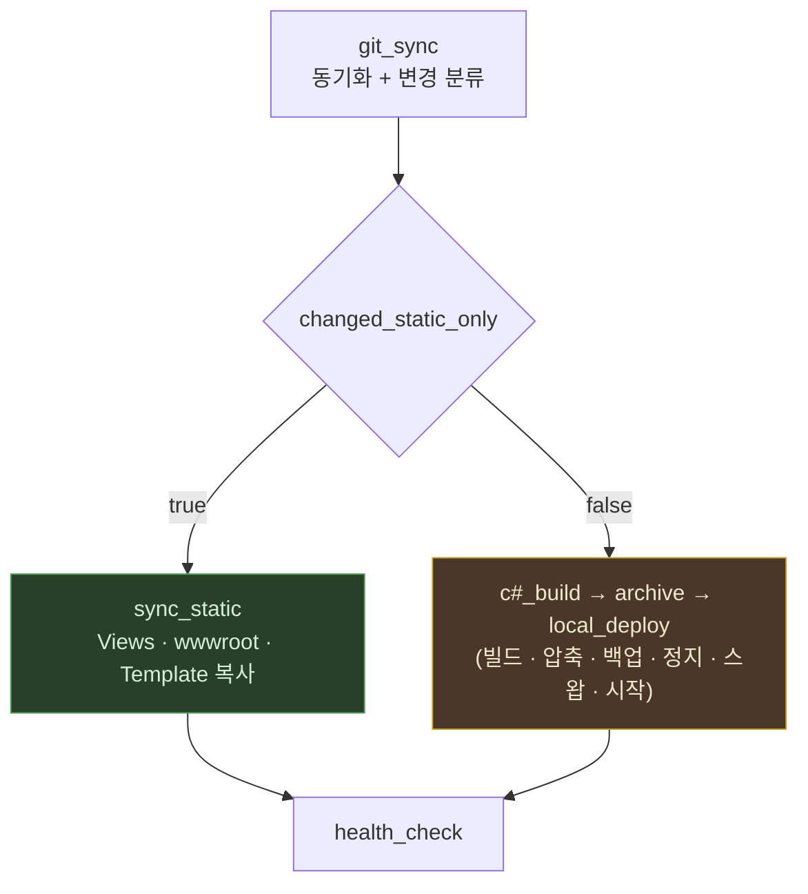
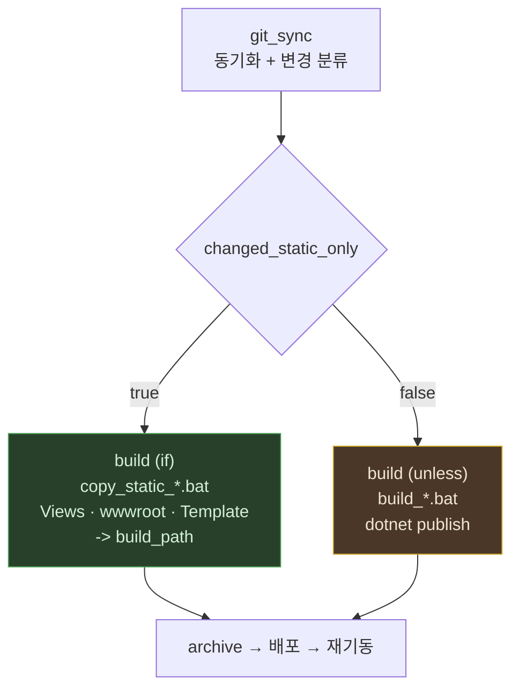

# 3. 정적 파일 빠른 배포

정적 파일만 바뀐 경우 **빌드·압축·스왑·재기동을 전부 건너뛰고 복사만** 한다.
서비스를 내리지 않으므로 사용자 입장에서 무중단이다.

---

## 왜 재기동이 필요 없는가

세 폴더 모두 **프로세스 시작 시점이 아니라 요청 시점에 디스크를 읽는다.**
DLL 이 배포본에 들어 있다는 것만으로 판단하면 안 되고, 호출 지점을 확인해야 한다.

| 폴더 | 근거 | 재기동 |
|---|---|---|
| `Views` | `MFM.Shore/Web/Program.cs:59` 에서 **`.AddRazorRuntimeCompilation()`** 호출 → `.cshtml` 변경 시 런타임 재컴파일 | 불필요 |
| `wwwroot` | `Program.cs:176` `app.UseStaticFiles()` → 요청마다 디스크에서 서빙 | 불필요 |
| `Template` | 컨트롤러가 `Path.Combine(contentRootPath, @"Template\...")` 로 요청 시점에 직접 읽음 (`CommonController.cs` · `ReportCreate.cs` 등) | 불필요 |

> ⚠️ Razor 런타임 컴파일은 **코드에서 켜야** 동작한다.
> `Microsoft.AspNetCore.Mvc.Razor.RuntimeCompilation.dll` 이 배포본에 있는 것만으로는
> 근거가 되지 않는다(전이 의존성일 수 있다). `AddRazorRuntimeCompilation()` 호출을 확인할 것.
> 이 설정이 빠지면 `.cshtml` 변경은 **재기동 없이는 반영되지 않는다.**

---

## 흐름



초록 경로는 **무중단**, 노랑 경로는 서비스 중단을 동반한다.

---

## 빠른 경로는 둘이다 — 어디에 복사하는가로 갈린다

위 흐름은 **라이브에 직접 복사**하는 쪽이다. 복사할 곳이 원격이면 쓸 수 없다 —
`sync_static` 은 `fs.cpSync` 라 로컬 파일시스템에서만 동작한다.

그래서 실제로는 두 가지가 있고, **어디에 복사하느냐**가 갈림길이다.

| | 라이브에 복사 | 산출물에 복사 |
|---|---|---|
| 스테이지 | `sync_static` (`if: changed_static_only`) | `build` 두 갈래 (`unless:` / `if:`) |
| 복사 대상 | `web_deploy_path` (라이브) | `build_path` (게시 산출물) |
| 이후 단계 | 전부 건너뜀 | archive → 배포 → 재기동을 **그대로 탄다** |
| 중단 | 없음 (무중단) | 있음 |
| 원격(qa·prod) | **불가** | 가능 |
| 절약 | 빌드 + 압축 + 배포 전부 | 빌드만 |

**MFM.Shore 는 산출물에 복사하는 쪽을 쓴다**(`deploy_shore.yaml`). qa·prod 가 원격이라
한 가지 방식으로 세 환경을 덮으려면 이쪽뿐이다. 무중단을 포기하는 대신 환경을 가리지 않는다.

산출물 쪽을 고를 때 **빌드를 건너뛰지 않고 복사하는 이유**가 있다. 그냥 건너뛰면 이전
산출물이 그대로 남고, `BuildStage.#verifyOutput` 이 "빌드 시작 이후에 쓰인 파일이 하나도
없다"며 배포를 실패시킨다. 그 검사는 낡은 산출물이 새것인 척 배포되는 것을 막으려고 있는
것이라 끄면 안 된다 — 복사하면 산출물이 실제로 최신이 되므로 검사를 **정면으로 통과한다.**



**판정은 node 가 하고 bat 은 시키는 대로만 한다.** bat 이 도달하는 시점에는 pull 이전
커밋이 이미 사라져서 스스로 판정할 근거가 없다 — `git_sync` 만이 `git_from`·`git_to` 를 쥔다.

> ⚠️ 두 갈래를 한 bat 안에서 인자로 분기시키지 않는다. 2026-09-11 에 그렇게 만들었다가
> 되돌렸다 — 한 파일이 컴파일과 복사 두 가지를 하게 되고, 쓰지 않는 인자를 `""` 로
> 비워 넘기는 자리가 생긴다. **파일을 나누면 분기가 yaml 에 드러나** `--dry-run` 이
> 어느 쪽으로 갈지 그대로 보여준다.

---

## 판정

`git_sync` 가 동기화 **전후 커밋을 비교**해 컨텍스트 변수를 채운다.

```yaml
- git_sync:
    static_paths:
      - "MFM.Shore/Web/Views/"
      - "MFM.Shore/Web/wwwroot/"
      - "MFM.Shore/Web/Template/"
```

| 변수 | 의미 |
|---|---|
| `changed_static_only` | 변경이 전부 `static_paths` 아래인가 |
| `has_changes` | 변경이 있었는가 |
| `changed_count` | 변경 파일 수 |
| `git_from` · `git_to` | 비교한 커밋 |

**안전한 쪽으로 기운다.** 다음 경우는 전부 `changed_static_only = false`(전체 배포)다.

- 최초 클론이라 비교 대상이 없음
- `git diff` 조회 실패
- `static_paths` 미지정

조용히 "정적"으로 판정해 빌드를 건너뛰는 일은 없다.

### 조건부 실행

스테이지에 `if:` / `unless:` 를 붙여 컨텍스트 변수로 분기한다.

```yaml
- build:
    unless: changed_static_only    # 참이면 건너뜀
- build:
    if: changed_static_only        # 참일 때만 실행
    cmd: "...copy_static_shore.bat ..."
```

같은 스테이지를 두 항목으로 둘 수 있다 — `stages` 는 배열이고 엔진은 항목마다 첫 키를
스테이지 이름으로 읽는다(`PipelineEngine.executeStage`).

값이 `false` · `0` · 빈 문자열이면 거짓으로 본다.
**미정의(`undefined`)도 거짓이다**(`isTruthy`). 그래서 그룹을 나눠 부르다 `--deploy-key`
이월이 끊기면 `unless:` 쪽이 살아 **전체 빌드로 떨어진다** — 느려질 뿐 틀리지 않는다.

`--dry-run` 에 조건이 함께 표시되므로 실행 전에 어느 경로로 갈지 확인할 수 있다.

> `c#_build` 는 옛 스테이지 이름이다. 현재 등록된 이름은 `build` 다.

---

## 결정사항 — 삭제는 반영하지 않는다

**2026-08-27 결정.** 정적 파일은 **추가·수정만** 복사한다.
git 에서 지운 정적 파일은 서버에 남는다.

이유는 `wwwroot` 다. 런타임 업로드 파일이 섞일 수 있어 **미러링(불필요 파일 삭제)은
운영 데이터를 지울 위험**이 있다. 삭제가 꼭 필요하면 수동으로 처리한다.

> 이 동작은 버그가 아니라 결정이다. `sync_static` 이 `fs.cpSync` 로 복사만 하는 것은 의도된 것이다.

삭제만 있는 커밋은 `changed_static_only = true` 로 판정되어 빠른 경로를 타지만
결과적으로 라이브는 바뀌지 않는다. 이 역시 위 결정의 귀결이다.

---

## 검증 결과 (2026-08-27)

임시 git 저장소에 실제 커밋을 만들어 분류를 확인했다.

| 경우 | 기대 | 결과 |
|---|---|---|
| `Views` 만 수정 | `true` | ✅ |
| `Views` + `wwwroot` + `Template` 동시 | `true` | ✅ |
| 정적 + `.cs` 하나 섞임 | `false` | ✅ |
| **`Views.cs`** (접두어 함정) | `false` | ✅ |
| 정적 파일 삭제 | `true` | ✅ |
| 정적 파일 추가 | `true` | ✅ |
| 같은 커밋(변경 없음) | `has_changes = false` | ✅ |
| 최초 클론 | `false` | ✅ |

실제 저장소 커밋 `3ef7c556 → 31be429b`(11건 중 `.cs` 6건 포함)도 전체 배포로 정확히 판정했다.

> ⚠️ 처음 검증은 **실제 저장소 최근 40커밋에 "정적만 변경" 사례가 없어** 참 분기가
> 한 번도 실행되지 않은 채 통과했다. 0건 통과는 통과가 아니다.
> 분류 로직을 고칠 때는 참 분기를 반드시 실제 커밋으로 확인할 것.

## 검증 결과 — 산출물 복사 경로 (2026-09-11)

`copy_static_shore.bat` 을 임시 폴더에서 실제로 실행해 확인했다.

| 경우 | 기대 | 결과 |
|---|---|---|
| 정상 복사 (`Views`·`wwwroot` 존재, `Template` 없음) | 복사 후 `exit 0` | ✅ 복사된 파일 실측 |
| 산출물 폴더 없음 | `exit 1` | ✅ |
| 인자 없음 | `exit 1` | ✅ |
| 소스에 정적 폴더가 하나도 없음 | `exit 1` | ✅ |
| `--dry-run` 으로 두 갈래 표시 | `build` 2단계가 조건과 함께 | ✅ 8단계 전부 등록 확인 |

**"복사 OK" 를 액면가로 받지 않고 복사된 파일 목록을 따로 조회했다** — `xcopy` 가 0건이어도
성공 메시지는 나온다.

> ⚠️ **아직 실제 파이프라인으로 참 분기를 태우지 않았다.** 위는 스크립트 단위 실행과
> `--dry-run` 이다. 정적 파일만 담긴 커밋으로 한 번 돌려 `changed_static_only` 가 실제로
> 참이 되고 3번 스테이지가 선택되는 것까지 확인해야 검증이 끝난다.

---

## 주의

**`.cshtml` 이 새 C# 타입을 참조하면** 런타임 컴파일이 요청 시점에 실패한다.
다만 그런 변경은 `.cs` 파일을 동반하므로 정적 판정에서 자동으로 걸러진다.

**첫 요청은 여전히 느리다.** 뷰가 바뀌면 그 뷰는 다음 요청에서 다시 컴파일된다.
전체 배포 후 첫 페이지 렌더는 약 50초가 걸린다([로컬 배포 흐름](01_로컬_배포_흐름.md) 참조).
