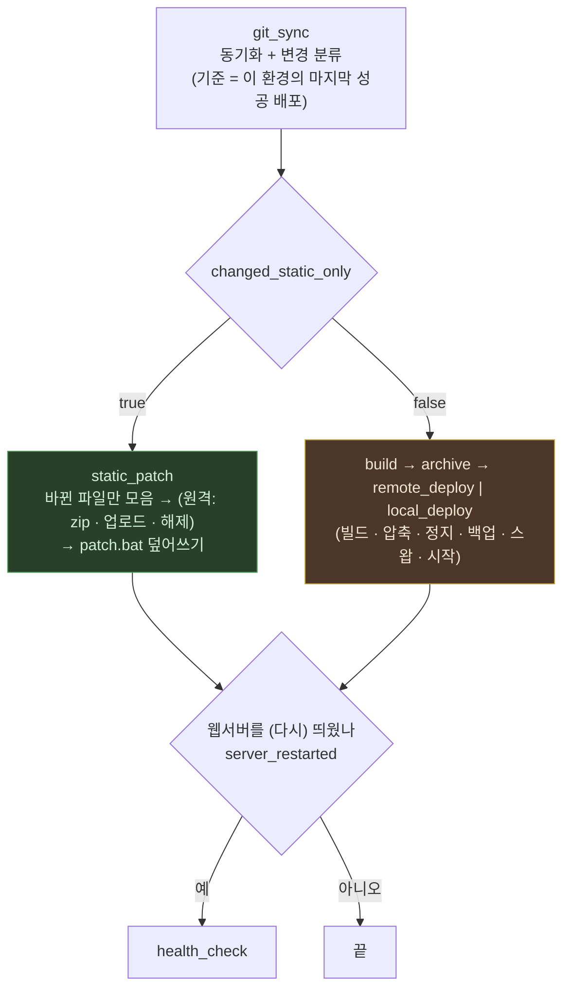

# 3. 정적 파일 빠른 배포

정적 파일만 바뀐 경우 **빌드·정지·백업·스왑을 전부 건너뛰고, 바뀐 파일만 라이브에 덮어쓴다.**
웹서버를 내리지 않으므로 사용자 입장에서 무중단이다. 로컬·원격이 같은 방식이다(`static_patch` → `patch.bat`).

---

## 왜 재기동이 필요 없는가

세 폴더 모두 **프로세스 시작 시점이 아니라 요청 시점에 디스크를 읽는다.**
DLL 이 배포본에 들어 있다는 것만으로 판단하면 안 되고, 호출 지점을 확인해야 한다.

| 폴더 | 근거 | 재기동 |
|---|---|---|
| `Views` | `MFM.Shore/Web/Program.cs:59` 에서 **`.AddRazorRuntimeCompilation()`** 호출 → `.cshtml` 변경 시 런타임 재컴파일 | 불필요 |
| `wwwroot` | `Program.cs:176` `app.UseStaticFiles()` → 요청마다 디스크에서 서빙 | 불필요 |
| `Template` | 컨트롤러가 `Path.Combine(contentRootPath, @"Template\...")` 로 요청 시점에 직접 읽음 (`CommonController.cs` · `ReportCreate.cs` 등) | 불필요 |

> ⚠️ Razor 런타임 컴파일은 **코드에서 켜야** 동작한다.
> `Microsoft.AspNetCore.Mvc.Razor.RuntimeCompilation.dll` 이 배포본에 있는 것만으로는
> 근거가 되지 않는다(전이 의존성일 수 있다). `AddRazorRuntimeCompilation()` 호출을 확인할 것.
> 이 설정이 빠지면 `.cshtml` 변경은 **재기동 없이는 반영되지 않는다.**

---

## 흐름



초록 경로는 **무중단**, 노랑 경로는 서비스 중단을 동반한다.

| 단계 | 로컬 (`deploy_remote: false`) | 원격 |
|---|---|---|
| 1. 바뀐 파일 목록 | `git diff --diff-filter=d git_from git_to` (삭제 제외) | 같음 |
| 2. 모으기 | `<build_path>_patch/` 에 **build_cwd 기준 상대경로**로 | 같음 |
| 3. 압축·업로드·해제 | 없음 | `<build_path 이름>_patch.zip` → `upload_path` → `<라이브>_patch_<시각>` |
| 4. 덮어쓰기 | `patch.bat` | `patch.bat` (ssh 한 번). 해제 폴더는 결과와 무관하게 지운다 |

- 경로 변환: `MFM.Shore/Web/Views/a.cshtml` → build_cwd(`MFM.Shore/Web`) 기준 → 라이브의 `Views/a.cshtml`.
  build_cwd 밖의 파일이 섞이면 **추측하지 않고 멈춘다** — `static_paths` 가 게시되지 않는 폴더를 가리킨다는 뜻이다.
- **zip 이름이 전체 배포 zip 과 다르다.** 전체 배포 zip 은 롤백 뒤 다시 앞으로 갈 때 쓰는 사본이라 덮으면 안 된다.
- `build_path` 자체는 건드리지 않는다. 다음 정적 배포는 그것을 보지 않고, 다음 전체 빌드가 새로 만든다.
- **롤백을 무장하지 않는다.** 백업을 만들지 않으므로 되돌릴 대상이 없다.

### 웹서버와 헬스체크

**헬스체크는 웹서버를 (다시) 띄웠을 때만 한다.** 로컬이든 원격이든, `health_url` 이 있으면.

| 상황 | 재시작 | 헬스체크 |
|---|---|---|
| 전체 배포 | 있음 (`deploy.bat`) | 함 |
| 정적 배포, 서버 살아 있음 | 없음 | 안 함 |
| 정적 배포, 서버 죽어 있음 | 복사 뒤 시작 | 함 |

"살아 있다" 는 IIS 의 **사이트와 앱풀이 둘 다 `Started`** 라는 뜻이다(`webserver_iis.bat` 의 `status`).
사이트만 떠 있고 앱풀이 멈췄으면 503 이므로 죽은 것으로 본다(빠른 실패 보호가 앱풀을 그렇게 멈춘다).
떠 있지만 500 을 내는 앱은 정적 배포에서 잡지 않는다 — 재시작이 없으니 확인하지 않는다는 결정이다.

`patch.bat` 은 서버를 시작했으면 종료코드 **6(성공)** 을 낸다. 스테이지가 그것을 보고 `server_restarted` 를 켜고,
`health_check` 는 `if: server_restarted` 로 돈다. 출력을 파싱하지 않으려고 코드로 받는다.

---

## 판정

### 비교 기준 — 이 환경의 마지막 성공 배포

`git_sync` 가 **배포 이력에서 이 환경의 마지막 성공 배포 커밋**(`git_to`)을 꺼내 새 HEAD 와 비교한다.
동기화 전 작업 폴더의 HEAD 가 **아니다.**

HEAD 를 기준으로 하면 안 되는 이유: 실패한 배포도 작업 폴더는 옮겨 놓는다. 다음 실행은 그 자리부터 비교하므로
**실패한 배포의 변경이 차이에서 빠진다.** 통째로 교체하는 전체 배포에서는 드러나지 않지만,
바뀐 파일만 복사하는 정적 배포에서는 그 파일이 **영영 안 올라간다** — 에러 없이.

이력을 기준으로 하면 실패한 배포의 변경은 다음 배포에 **누적되어 함께 나간다**("기존 변경 + 추가 변경").
중간에 끊긴 복사도 다음 실행이 같은 범위를 다시 덮는다. 공지의 변경 내역도 같은 범위다.

| 기준을 못 잡는 경우 | 결과 |
|---|---|
| 이 환경의 성공 배포 이력이 없음 (첫 배포, 설정 폴더 없음) | 정적 판정 없이 **전체 배포** |
| 강제 롤백(`--rollback=N`)이 마지막 성공 배포보다 최근 | 전체 배포 — 라이브가 옛 백업이라 이력의 커밋과 다르다 |
| 이력의 커밋이 저장소에 없음 (강제 푸시 등) | 전체 배포 — 차이를 구할 수 없다 |
| 이력의 값이 커밋 모양이 아님 | 전체 배포 — 명령줄에 넣지 않는다 |

> 배포 이력은 **환경별 파일**이다(`<yaml>.<환경>.json`). 락이 환경별이라 qa·prod 가 동시에 도는데,
> 파일이 하나면 서로의 기록을 덮어써 기준이 틀어진다. 환경을 가르기 전의 공용 파일(`<yaml>.json`)은
> 환경 파일이 없을 때 이 환경의 기록만 읽어 옮긴다.

### 변수

```yaml
- git_sync:
    static_paths:
      - "MFM.Shore/Web/Views/"
      - "MFM.Shore/Web/wwwroot/"
      - "MFM.Shore/Web/Template/"
```

| 변수 | 의미 |
|---|---|
| `changed_static_only` | 변경이 전부 `static_paths` 아래인가 |
| `has_changes` | 변경이 있었는가 |
| `changed_count` | 변경 파일 수 |
| `git_from` · `git_to` | 비교한 커밋 (`git_from` = 기준 커밋) |
| `server_restarted` | 이번 배포가 웹서버를 (다시) 띄웠는가 — 배포 스테이지가 채운다 |

**안전한 쪽으로 기운다.** 위 "기준을 못 잡는 경우" 외에도 다음은 전부 `changed_static_only = false`(전체 배포)다.

- 최초 클론이라 비교 대상이 없음 (기준 커밋도 없을 때)
- `git diff` 조회 실패
- `static_paths` 미지정

조용히 "정적"으로 판정해 빌드를 건너뛰는 일은 없다.

### 조건부 실행

스테이지에 `if:` / `unless:` 를 붙여 컨텍스트 변수로 분기한다. **이름 하나 또는 목록**을 받는다.

```yaml
- archive:       { group: build,  if: compress, unless: changed_static_only }
- remote_deploy: { group: deploy, if: deploy_remote, unless: changed_static_only }
- local_deploy:  { group: deploy, unless: [deploy_remote, changed_static_only] }   # 하나라도 참이면 건너뜀
- static_patch:  { group: deploy, if: changed_static_only }
- health_check:  { group: deploy, if: server_restarted }
```

| 형태 | 뜻 |
|---|---|
| `if: a` · `if: [a, b]` | 전부 참일 때만 실행 |
| `unless: a` · `unless: [a, b]` | 하나라도 참이면 건너뜀 |
| `if` + `unless` 함께 | 둘 다 만족할 때 실행 |

값이 `false` · `0` · 빈 문자열이면 거짓으로 본다.
**미정의(`undefined`)도 거짓이다**(`isTruthy`). 그래서 그룹을 나눠 부르다 `--deploy-key`
이월이 끊기면 `unless:` 쪽이 살아 **전체 배포로 떨어진다** — 느려질 뿐 틀리지 않는다.

`--dry-run` 에 조건이 함께 표시되므로 실행 전에 어느 경로로 갈지 확인할 수 있다.

---

## 결정사항 — 삭제는 반영하지 않는다

**2026-08-27 결정.** 정적 파일은 **추가·수정만** 복사한다.
git 에서 지운 정적 파일은 서버에 남는다. 이름 바꾸기는 새 이름만 복사되고 옛 이름은 남는다.

이유는 `wwwroot` 다. 런타임 업로드 파일이 섞일 수 있어 **미러링(불필요 파일 삭제)은
운영 데이터를 지울 위험**이 있다. 삭제가 꼭 필요하면 수동으로 처리한다.

> 이 동작은 버그가 아니라 결정이다. 목록을 `--diff-filter=d` 로 뽑고 `robocopy` 에 `/MIR`·`/PURGE` 를 쓰지 않는 것은 의도된 것이다.

삭제만 있는 커밋은 `changed_static_only = true` 로 판정되어 빠른 경로를 타지만
복사할 파일이 없어 아무것도 하지 않는다. 이 역시 위 결정의 귀결이다.

---

## 이력 — 산출물 복사 방식을 버린 이유 (2026-09-18)

이전에는 정적 변경을 **산출물(`build_path`)에 복사**(`copy_static_shore.bat`)한 뒤 전체 배포와 같은
압축 → 배포 → 재기동을 탔다. dev 젠킨스 `plWesysDeployNode` #9 에서 이 경로가 실패했다.

- `BuildStage` 의 산출물 갱신 검사가 **3단계 깊이까지만** 봤다. 바뀐 파일은 `Views\ERP\FI\VL\*.cshtml`(4단계)이라
  아예 보지 않고 "갱신 안 됨" 으로 판정했다 → 깊이 제한을 없앴다.
- `xcopy` 는 **원본 수정시각**을 그대로 붙인다. 원본은 git 이 동기화 때 쓴 것이라 빌드 시작보다 앞선다
  (젠킨스가 그룹을 나눠 부르므로 늘 그렇다). 깊이 문제가 없었어도 실패했을 것이다.

즉 수정시각으로 "새것인가" 를 검사하는 방식과 복사는 맞지 않았다. 지금은 산출물을 검사하지 않고
**git 을 믿는다** — 믿는 근거가 위의 비교 기준(이력의 마지막 성공 배포)이다.

---

## 검증 결과

### 분류 (2026-08-27)

임시 git 저장소에 실제 커밋을 만들어 분류를 확인했다.

| 경우 | 기대 | 결과 |
|---|---|---|
| `Views` 만 수정 | `true` | ✅ |
| `Views` + `wwwroot` + `Template` 동시 | `true` | ✅ |
| 정적 + `.cs` 하나 섞임 | `false` | ✅ |
| **`Views.cs`** (접두어 함정) | `false` | ✅ |
| 정적 파일 삭제 | `true` | ✅ |
| 정적 파일 추가 | `true` | ✅ |
| 같은 커밋(변경 없음) | `has_changes = false` | ✅ |
| 최초 클론 | `false` | ✅ |

> ⚠️ 처음 검증은 **실제 저장소 최근 40커밋에 "정적만 변경" 사례가 없어** 참 분기가
> 한 번도 실행되지 않은 채 통과했다. 0건 통과는 통과가 아니다.
> 분류 로직을 고칠 때는 참 분기를 반드시 실제 커밋으로 확인할 것.

### 정적 배포 (2026-09-18, `npm test`)

진짜 git 저장소와 진짜 `patch.bat` 으로 돌린다(`test/gitSync.test.js` · `test/staticPatch.test.js`).

| 경우 | 결과 |
|---|---|
| 실패한 배포 뒤 — 기준(A)부터 B·C 변경을 모두 잡음, 작업 폴더 HEAD(B) 가 아니라 | ✅ |
| 이력 없음 · 강제 롤백 직후 · 커밋 없음 · 커밋 모양 아님 → 전체 배포 | ✅ |
| 바뀐 파일만 라이브에 — 삭제 미반영, 업로드·DLL 그대로 | ✅ |
| 서버 살아 있음 → `status` 만, 재시작·헬스체크 없음 (가짜 어댑터) | ✅ |
| 서버 죽어 있음 → 복사 뒤 `start`, 종료코드 6, `server_restarted` | ✅ |
| 라이브 경로 오타 → 4, 폴더를 새로 만들지 않음 | ✅ |
| build_cwd 밖의 파일 → 멈춤, 라이브 그대로 | ✅ |
| 원격 — 명령 순서, zip 에 바뀐 파일만, 실패해도 해제 폴더 삭제 | ✅ |
| `webserver_iis.bat status` 를 이 PC 의 IIS 에 실제로 — `site MFM.SHORE_QA Stopped, apppool Started` → 6 | ✅ |

> ⚠️ **아직 실제 파이프라인으로 원격 정적 배포를 태우지 않았다.** 위는 테스트와 스크립트 단위 실행이다.
> 정적 파일만 담긴 커밋으로 qa 를 한 번 돌려 `static_patch` 가 선택되고 라이브에 파일이 들어가는 것까지 봐야 끝난다.

---

## 주의

**`.cshtml` 이 새 C# 타입을 참조하면** 런타임 컴파일이 요청 시점에 실패한다.
다만 그런 변경은 `.cs` 파일을 동반하므로 정적 판정에서 자동으로 걸러진다.

**첫 요청은 여전히 느리다.** 뷰가 바뀌면 그 뷰는 다음 요청에서 다시 컴파일된다.
전체 배포 후 첫 페이지 렌더는 약 50초가 걸린다([로컬 배포 흐름](01_로컬_배포_흐름.md) 참조).

**덮어쓰는 몇 초 동안은 새 파일과 옛 파일이 섞인다.** 파일 단위로 원자적이지 않다. 정적 파일이라 받아들인 결정이다.
뷰·템플릿이 잠깐 열려 있으면 `robocopy` 가 2초 간격으로 3번 다시 시도한다. 끝내 실패하면 배포 실패(1)이고,
다음 배포가 같은 범위를 다시 복사한다.
